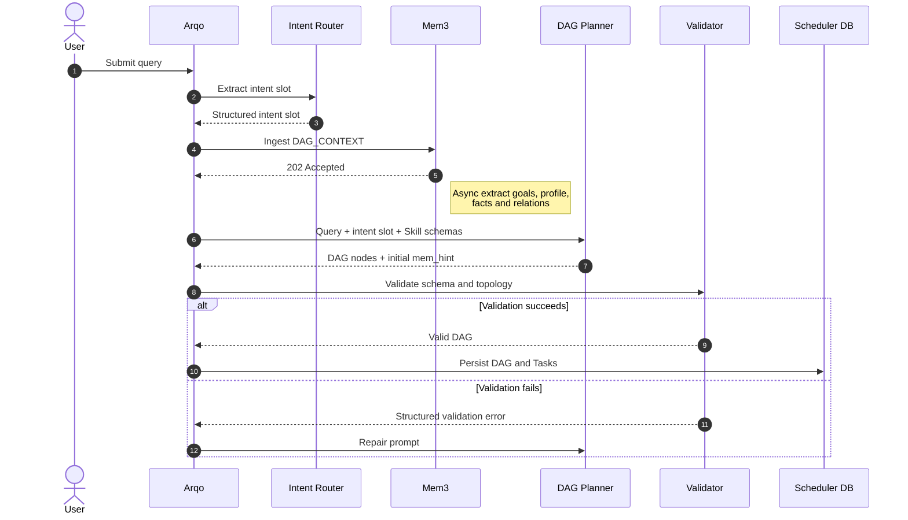

# **Aurora Intent Router**

本模块是 Aurora 大规模 Agentic 系统的“中央大脑”。其核心目标是将用户不可枚举、充满歧义的自然语言请求，稳定、精确地转化为系统可执行的、合法的有向无环图（DAG），并实现极低的延迟与计算成本。

## **1. 架构概览与核心工作流**

意图路由模块放弃了传统的“单一黑盒大模型生成全图”的粗放模式，采用了**“降维提取 -> 受限生成 -> 静态校验”**的三段式漏斗架构。

1. **Step 1: 意图降维与插槽提取 (Intent Slotting)**：利用轻量级微调模型（如 Llama-3-8B），将自然语言降维成结构化的意图特征与实体。
2. **Step 2: DAG 骨架生成 (Restricted Generation)**：基于提取的特征，结合预设的 Skill Schema，再次利用大模型进行受限解码，生成初步的 DAG JSON。
3. **Step 3: DAG Context Ingest**：将原始 Query 与结构化 intent slot 发送到 Mem3；Mem3 可靠接收后异步提取并存储 Goal、Profile、Facts 与 Relations。
4. **Step 4: 编译器级静态校验 (DAG Validator)**：使用纯代码逻辑对生成的 JSON 进行严苛的图论检查，确保 100% 物理合法。

DAG 中的每个 Node（或者称为 Step）只有两类：可直接映射具体 Skill 的 Skill Node，以及需要通过 JIT 动态扩图进一步拆解任务的 Planner Node。

### **1.1 Query 到 DAG 的时序**



## **2. 模块一：基于 Llama 轻量模型的意图与实体插槽提取**

### **2.1 核心挑战**

用户的自然语言诉求是无限的且存在严重的“语义漂移”。直接让大模型输出包含几十个节点的 DAG 极易产生幻觉和逻辑断裂。

### **2.2 解决方案：Intent-Slot Generation**

我们在网关层前置一个轻量级的开源模型（推荐 Llama-3-8B-Instruct），专门用于“阅读理解”和“特征提取”。通过 response_format: { type: "json_schema" } (受限解码)，强制其输出高度结构化的插槽数据。

**输入 (User Query)**:

"帮我看看昨天线上支付服务一直报的那个数据库死锁，总结一下原因，然后用邮件发给后端组长。"

**Llama-3-8B 的 JSON Schema 约束定义**:

```json
{
  "type": "object",
  "properties": {
    "macro_intent": {
      "type": "string",
      "enum": ["DATA_RETRIEVAL", "TROUBLESHOOTING", "REPORT_GENERATION", "ACTION_EXECUTION", "UNKNOWN"],
      "description": "宏观大类，用于决定大致的流转走向"
    },
    "entities": {
      "type": "array",
      "items": { "type": "string" },
      "description": "提取出的核心名词/实体"
    },
    "temporal_context": { "type": "string", "description": "时间范围约束" },
    "action_verbs": {
      "type": "array",
      "items": { "type": "string" },
      "description": "用户期望执行的动作动词"
    }
  },
  "required": ["macro_intent", "entities", "action_verbs"]
}
```

**输出 (提取结果)**:

```json
{
  "macro_intent": "TROUBLESHOOTING",
  "entities": ["支付服务", "数据库死锁", "后端组长"],
  "temporal_context": "昨天",
  "action_verbs": ["看看 (查询)", "总结", "用邮件发给"]
}
```

*优势*：这一步极大降低了后续 DAG 生成的理解难度，将黑盒的自然语言变成了白盒的特征变量。

### **2.3 Mem3 DAG Context Ingest**

Intent Slot 提取成功后，Arqo 必须先调用 Mem3 `Ingest(kind=DAG_CONTEXT)`，请求中携带可信执行边界 `tenant_id/agent_id/session_id/dag_id`、原始 Query 与完整 intent slot。Intent Router 不负责生成长期记忆条目；Mem3 返回 `202 Accepted` 后异步提取 Goal、Profile、Facts 与 Relations，并写入 KV/Graph。

完整请求及异步提取结果 Schema 参考 `doc/spec/Mem3-API-Spec.md`。Intent Router 不得自行把信息提升到 Agent 或 Tenant 作用域。

## **3. 模块二：DAG 受限生成引擎 (Structured DAG Generation)**

### **3.1 核心机制**

基于第一步提取出的意图插槽（Slots）和实体，Go 网关将组装完整的 Prompt，提交给负责规划的主力模型（如微调后的 Llama 或云端大模型）。

### **3.2 强类型约束的 JSON Schema**

为了保证 LLM 吐出的数据能够被 Go 的 json.Unmarshal 完美解析，必须施加极其严密的受限解码约束。

**Schame规约**

DAG 生成两种类型的 Node，分别为 Skill Node 与 Planner Node。
- Skill Node 经过LLM判断确定可以映射为具体已注册Skill的Node，不会再进行Expand Plan的LLM调用。
- Planner Node 不能直接映射为 Skill，需要进行 JIT Planning 并继续生成子 DAG。

```json
{
  "type": "object",
  "properties": {
    "dag_id": { "type": "string" },
    "nodes": {
      "type": "array",
      "items": {
        "type": "object",
        "properties": {
          "node_id": { "type": "string", "pattern": "^[a-zA-Z0-9_]+$" },
          "skill_name": {
             "type": "string",
             "enum": ["QueryLog", "LLMSummarize", "SendEmail", "SearchGraph"]
          },
          "goal": { "type": "string", "minLength": 1 },
          "node_type": {
            "type": "string",
            "enum": ["skill", "planner"]
          },
          "mem_hint": {
            "$ref": "https://aurora/spec/mem-hint.schema.json#/properties/mem_hint"
          },
          "dependencies": {
            "type": "array",
            "items": { "type": "string" }
          },
          "input_parameters": { "type": "object" }
        },
        "required": ["node_id", "node_type", "mem_hint", "dependencies"],
        "allOf": [
          {
            "if": {
              "properties": { "node_type": { "const": "skill" } }
            },
            "then": { "required": ["skill_name"] }
          },
          {
            "if": {
              "properties": { "node_type": { "const": "planner" } }
            },
            "then": { "required": ["goal"] }
          }
        ]
      }
    }
  },
  "required": ["dag_id", "nodes"]
}
```

**DAG构建过程**

```Golang
package arqo

import "context"

// ==================== 1. 核心数据结构定义 ====================

// NodeType 定义节点的两种根本属性
type NodeType string

const (
	NodeTypeSkill   NodeType = "skill"   // 执行节点，直接映射已知 Skill
	NodeTypePlanner NodeType = "planner" // 规划节点，无法直接映射，需进一步拆分
)

// Node 代表 DAG 中的一个执行单元
type Node struct {
	ID           string
	DAGID        string
	Type         NodeType
	SkillName    string                 // 仅 Type == NodeTypeSkill 时有效
	Goal         string                 // 仅 Type == NodeTypePlanner 时有效，指示该节点要达成的目标
	Parameters   map[string]interface{}
	MemHint      MemHint                // Task 开始前由 Arqo 原样交给 Mem3 Search
	Dependencies []string
}

// IntentContext 来自 Intent Router 的意图上下文
type IntentContext struct {
	MacroIntent string
	IntentScore float64
	Slots       map[string]interface{}
}

// ==================== 2. Orchestrator: 初始 DAG 生成 ====================

type Orchestrator struct {
	LLMClient *LLMProxy
	Registry  *SkillRegistry // 全局 Skill 注册表
}

// GenerateInitialDAG 根据意图路由的结果，生成初始静态主干 DAG
func (o *Orchestrator) GenerateInitialDAG(ctx context.Context, intent IntentContext) ([]*Node, error) {
	// 获取当前系统所有合法的 Skill Schema，用于供 LLM 参考
	availableSkills := o.Registry.GetAvailableSkillSchemas()

	// 构造 Prompt：要求 LLM 优先映射 Skill Node，无法映射时输出 Planner Node
	prompt := buildOrchestratorPrompt(intent, availableSkills)

	// 使用受限解码强制 LLM 输出 DAG 结构的 JSON
	dagJSON := o.LLMClient.GenerateStructured(ctx, prompt, DAGSchema)

	// 解析并返回初始节点列表 (随后存入 TiDB)
	return parseToNodes(dagJSON), nil
}

// ==================== 3. Arqo Dispatcher: 节点执行与 JIT 扩图 ====================

type Dispatcher struct {
	LLMClient *LLMProxy
	Registry  *SkillRegistry
	DB        *TiDBClient // 操作 TiDB 进行事务扩图
}

// ExecuteNode 当某个节点前置依赖归零，变成 READY 态时，Arqo 调度执行该节点
func (d *Dispatcher) ExecuteNode(ctx context.Context, node *Node, memoryCtx MemoryContext) error {

	// 运行时二次研判 (Runtime Resolution)：
	// 如果它是 Planner Node，判断系统当前是否已经有刚好能覆盖其 Goal 的新 Skill
	if node.Type == NodeTypePlanner {
		if matchedSkill := d.Registry.FindExactMatch(node.Goal); matchedSkill != "" {
			// 动态降级：直接变异为 Skill Node，免去一次昂贵的 LLM 拆分调用
			node.Type = NodeTypeSkill
			node.SkillName = matchedSkill
		}
	}

	// 核心状态机路由
	switch node.Type {
	case NodeTypeSkill:
		// 叶子节点：直接路由给底层的 TS Worker 集群执行
		return d.dispatchToTSWorker(node, memoryCtx)

	case NodeTypePlanner:
		// Planner Node：无法直接执行，必须调用 LLM 进行子图拆分 (JIT Planning)
		return d.spawnSubDAG(ctx, node, memoryCtx)
	}

	return nil
}

// spawnSubDAG 执行子 DAG 的拆分与热插拔
func (d *Dispatcher) spawnSubDAG(ctx context.Context, plannerNode *Node, memoryCtx MemoryContext) error {
	availableSkills := d.Registry.GetAvailableSkillSchemas()

	// 组装 ReAct 扩图 Prompt，传入当前节点的 Goal 和系统已积攒的 Memory 上下文
	prompt := buildIncubatePrompt(plannerNode.Goal, memoryCtx, availableSkills)

	// 调用 LLM 生成新的子节点组
	subDAGJSON := d.LLMClient.GenerateStructured(ctx, prompt, SubDAGSchema)
	newNodes := parseToNodes(subDAGJSON)

	// 开启 TiDB 分布式事务，进行热插拔操作 (Hot-Plugging)
	tx := d.DB.BeginTx()
	defer tx.Rollback()

	// 1. 将新生成的子节点插入数据库，初始状态设为 PENDING
	for _, n := range newNodes {
		tx.InsertNode(plannerNode.DAGID, n)
	}

	// 2. 依赖重定向 (Downstream Wiring)
	// 将原本依赖 plannerNode 的下游节点，其依赖指针改绑到 newNodes 的尾部节点上
	tailNodes := findTailNodes(newNodes)
	tx.RedirectDependencies(plannerNode.ID, tailNodes)

	// 3. 将当前的 Planner 节点状态标记为 SUCCESS
	// 它没有执行具体的物理动作，它的使命就是“繁衍”出具体的子执行路径
	tx.MarkNodeSuccess(plannerNode.ID)

	// 4. 提交事务
	// 事务提交后，如果 newNodes 中有节点没有前置依赖，
	// TiDB 会触发其变为 READY，Arqo 的抢占协程会瞬间接管执行。
	return tx.Commit()
}
```

- 初始 DAG Planner 必须为每个节点生成 `mem_hint` 初始值，并为根节点直接生成最终值。
- 非根节点的父 Task 全部完成后，Arqo 使用父 Task outputs、子 Task goal 与初始值调用规划 LLM，生成子 Task 最终 `mem_hint`。
- 多父节点 Task 必须一次性使用全部父 Task outputs 生成最终值，禁止由最后完成的父节点覆盖其他来源。
- Planner Node 动态扩图时，也必须为每个直接子节点生成 `mem_hint` 初始值。
- 每个 Task 从 `READY` 进入 `RUNNING` 前，Arqo 必须调用 Mem3 Search，并同时取得 last-N outputs、最新 rolling summary 与 `mem_hint` 定向检索结果。
- 调用LLM，也是一个predefined skill，内置在系统中。
- 如果一个Node多次扩展DAG均无法映射确定的Skill，为避免子图无限递归，我们需要把这种情况返回UI层（通过抛出异常），提示用户需要新的Skill，或无法进行具体的xx操作。

**NOTES**
- skill_name在非skill node中可以为空。

### **3.3 动态 RAG 提示词注入 (Few-Shot 增强)**

为了应对不在预设范围内的新意图，Go 网关会在生成阶段利用第一步提取的 macro_intent，去向量库中检索 2-3 个最相似的**成功历史 DAG 案例**，作为 Few-Shot 样本拼接到 Prompt 中，实现意图理解的热更新。

## **4. 模块三：编译器级 DAG 后校验引擎 (The Validator)**

### **4.1 为什么需要后校验？**

尽管使用了受限解码（保证了 JSON 格式和字段类型绝对正确），但它**无法保证图论意义上的合法性**。LLM 依然可能生成包含循环依赖（A 依赖 B，B 依赖 A）的拓扑图，直接写入数据库会导致系统死锁。

### **4.2 核心校验流程 (Go 代码实现层)**

在 Go 网关接收到 LLM 生成的 DAG JSON 后，必须经过以下三道关卡，全部通过后才能写入 TiDB。

#### **关卡 1：拓扑循环检测 (Cycle Detection)**

* **算法**: 必须实现标准的**拓扑排序算法 (Kahn's Algorithm 或 DFS)**。
* **逻辑**: 尝试对 nodes 进行拓扑排序。如果排序完成时，排好的节点数少于总节点数，说明图中存在环（Cycle）。
* **动作**: 立即拦截，报错 DAG_VALIDATION_FAILED: Cycle detected。

#### **关卡 2：悬空依赖检测 (Dangling Dependencies)**

* **问题**: LLM 生成了 node_C 依赖 node_X，但在 nodes 列表中根本不存在 node_X。
* **逻辑**: 遍历所有节点的 dependencies 数组，检查其引用的 node_id 是否在当前图的节点集合中真实存在。
* **动作**: 拦截并报错 DAG_VALIDATION_FAILED: Unknown dependency 'node_X'。

#### **关卡 3：孤岛节点检测 (Isolated Nodes Warning)**

* **问题**: 某个节点既没有依赖别人，也没有被人依赖（除了入口点和出口点）。
* **逻辑**: 检查该节点的入度和出度。
* **动作**: 这通常不是致命错误，但可能意味着 LLM 生成了无效操作。可根据业务策略选择拦截或发出 Warning。

### **4.3 校验失败的处理策略 (Retry Loop)**

如果 Validator 校验失败，系统不会直接抛弃任务。

1. Go 网关将底层的报错（例如："你的图中存在 A->B->A 的循环"）提取出来。
2. 将该报错重新组装成一条反馈 Prompt 扔给大模型：“你生成的 DAG 包含死循环，请修正依赖关系并重新输出。”
3. 设定最大重试次数（如 3 次），超过则标记意图解析彻底失败，转交人工干预。

## **5. 模块总结**

通过这套**“轻模型降维 -> 强约束生成 -> 代码级死守”**的三重保险机制，Aurora 的大脑彻底摆脱了传统 Agent 生成不可控、执行易崩溃的顽疾，实现了工业级的稳定性与确定性。
