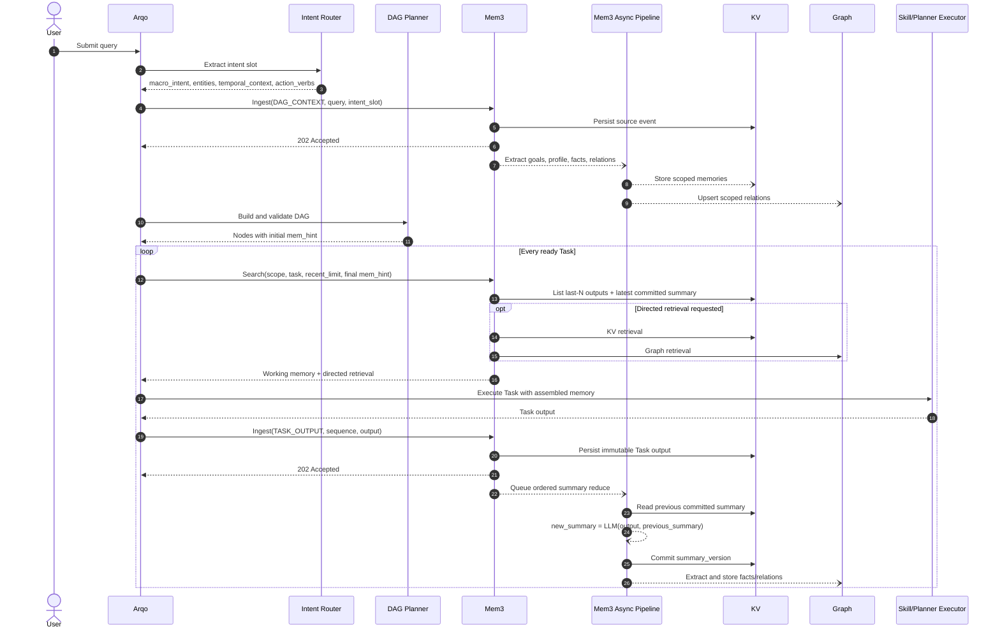
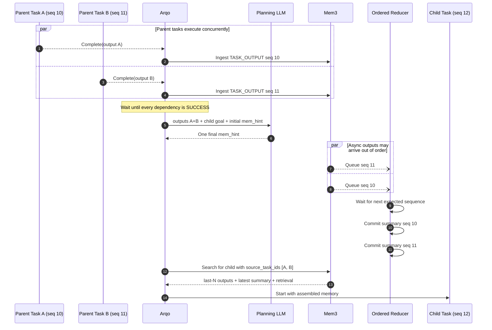

# Mem3 记忆系统详细设计

Mem3 是 Aurora 的统一记忆数据平面，负责 DAG 初始化记忆、Task 滑动窗口记忆、滚动摘要以及跨会话 GraphRAG。接口的规范定义参见 `doc/spec/Mem3-API-Spec.md`，检索提示规范参见 `doc/spec/Mem-Hint-Schema.md`。

## 1. 核心原则

1. 调度状态保存在 Arqo 的关系数据库中；记忆数据保存在 Mem3 的 KV 与 Graph 存储中。
2. 每次 DAG 构建都必须提取 intent slot，并调用一次 DAG 级 Ingest。
3. 每个 Task 开始执行前都必须调用 Search。Search 固定装配 last-N 个 Task output 与最近一次 rolling summary，再按 `mem_hint` 执行定向检索。
4. 每个成功完成的 Task（包括 Skill Node 与 Planner Node）都必须调用 Task 级 Ingest。
5. Ingest 快速持久化原始事件并返回 accepted；LLM 提取、rolling summary reduce 与图谱写入均在 Mem3 内异步完成。
6. `tenant_id` 是强制隔离边界；`agent_id` 是长期记忆命名空间。`session_id` 与 `dag_id` 用于执行期记忆隔离。

## 2. 存储模型

### 2.1 DAG 级长期记忆

DAG 构建时，Intent Router 从用户 Query 提取结构化 intent slot，并调用：

```text
POST /v1/memory/ingest
kind = DAG_CONTEXT
```

Mem3 首先将原始 Query 与 intent slot 写入可靠事件存储，然后异步完成：

- Goal：用户希望当前 Agent 达成的目标。
- Profile：相对稳定的用户、Agent 或 Tenant 属性。
- Facts：可独立验证的事实。
- Relations：用于 GraphRAG 的实体关系。

存储作用域由每条候选记忆的 `memory_scope` 决定：

- `DAG`：仅当前 DAG 可见。
- `SESSION`：当前 Session 可见。
- `AGENT`：同一 Tenant 下指定 Agent 可见。
- `TENANT`：同一 Tenant 下所有 Agent 可见。

未经置信度和策略校验的信息不得直接提升为 `AGENT` 或 `TENANT` 级长期记忆。Graph 节点和边必须携带 `tenant_id`、`agent_id`、`observed_at` 与来源信息。

### 2.2 Task 情景记忆

每个 Task 完成后保存一条不可变 Task Memory：

```json
{
  "tenant_id": "tenant_1",
  "agent_id": "agent_1",
  "session_id": "session_1",
  "dag_id": "dag_1",
  "task_id": "task_3",
  "node_type": "skill",
  "output": {},
  "rolling_summary": "截至 task_3 的累计摘要",
  "hard_facts": [],
  "relations": [],
  "completed_at": "2026-06-23T10:00:00Z"
}
```

推荐 KV Key：

```text
tenant:{tenant_id}:agent:{agent_id}:session:{session_id}:dag:{dag_id}:task:{sequence}:{task_id}
```

`sequence` 必须由 Arqo 在同一 DAG 内单调分配，不能依赖异步处理完成顺序，否则并行 Task 会破坏 last-N 的确定性。

## 3. 生命周期

### 3.0 端到端记忆时序

下图给出一次 DAG 从创建到 Task 完成的标准时序。虚线箭头表示异步处理，不阻塞 Arqo 的主调度链路。



### 3.1 DAG 构建

```text
User Query
  -> Intent Router 结构化提取
  -> Mem3 Ingest(DAG_CONTEXT)
  -> Arqo 使用相同 intent slot 构建 DAG
```

Intent Router 不等待 GraphRAG 异步构建完成。只要 Mem3 已可靠接收事件即可继续生成 DAG。若 Ingest 不可用，Arqo 按策略重试或将 DAG 标记为 memory-degraded，不能静默丢弃。

### 3.2 Task 开始前

每个 Task 从 `READY` 进入 `RUNNING` 前，Arqo 调用：

```text
POST /v1/memory/search
```

请求必须携带：

- 当前 Task 标识与作用域。
- 父 Task 完成后由规划 LLM 生成或刷新的 `mem_hint`。
- `recent_limit=N`。

初始 DAG 中保存的是每个节点的 `mem_hint` 初始值。父 Task 完成后，Arqo 使用父 Task output、子 Task goal 与初始值调用规划 LLM，生成最终 `mem_hint` 并写回子 Task；随后子 Task 才能进入记忆装配阶段。根 Task 没有父 Task，其最终 `mem_hint` 由初始 DAG Planner 生成。

多父 Task 场景必须等待全部父 Task 完成，再使用全部父 Task outputs 一次性生成最终 `mem_hint`，并在 Search 请求的 `mem_hint_source_task_ids` 中记录来源，禁止采用“最后完成者覆盖”的竞态语义。

Search 的结果固定由两部分组成：

1. 工作记忆：
   - 按 DAG 执行序列返回最近 N 个已完成 Task 的 output。
   - 返回最近一次已提交的 rolling summary。
2. 定向记忆：
   - 根据 `mem_hint` 查询 KV 精确记录、Agent/Tenant 长期记忆或 GraphRAG。

即使 `mem_hint.strategy=NONE`，工作记忆仍必须返回；`NONE` 只表示不执行额外的定向检索。

### 3.3 Task 完成后

每个 Skill Node 或 Planner Node 成功完成后，Arqo 调用：

```text
POST /v1/memory/ingest
kind = TASK_OUTPUT
```

Mem3 的处理顺序：

1. 可靠保存 Task output 与任务元数据。
2. 返回 `202 Accepted`，避免轻量 LLM 延迟阻塞调度器。
3. 按 DAG 提交序列串行化 summary reduce：

```text
new_summary = lightweight_llm.reduce(
  output = current_task.output,
  last_summary = previous_committed_summary
)
```

4. 原子保存 `new_summary` 并推进 summary version。
5. 异步提取 hard facts 与 relations，分别写入 KV/Graph。

Skill 返回的局部 `summary` 只能作为 reduce 输入提示，不能代替 Mem3 生成的 rolling summary。Planner Node 的规划结果同样属于 Task output，必须写入 Mem3。

并行 Task 可能乱序完成，因此 summary reduce 必须按照 Arqo 分配的 `sequence` 提交。缺失前序时可以等待、重试或进入补偿队列，禁止用“异步完成先后”覆盖摘要。

### 3.4 多父 Task 与并行 Reduce 时序

此图明确两个独立的顺序约束：

- 子 Task 的最终 `mem_hint` 必须等待所有父 Task 完成后一次性生成。
- Task output 可以乱序到达 Mem3，但 rolling summary 必须按 `sequence` 顺序提交。



## 4. API 语义

### 4.1 Ingest

统一入口根据 `kind` 接收两类事件：

- `DAG_CONTEXT`：原始 Query 与 intent slot。
- `TASK_OUTPUT`：成功 Task 的 output。

响应只确认事件是否可靠接收，不承诺异步提取已经完成。

### 4.2 List

List 是 Search 装配工作记忆时调用的确定性 KV 操作：

- 按 `sequence DESC` 获取 last-N 个成功 Task。
- 返回 output，不将 last-N outputs 再拼接成一个 summary。
- 独立返回最新 committed rolling summary。
- 不跨越请求中的 Tenant、Agent、Session 与 DAG 边界。

### 4.3 Search

Search 是 Task 执行前的唯一记忆读取入口。内部先调用 List 获取工作记忆，再解释 `mem_hint`：

```text
working_context = List(scope, recent_limit)
retrieval = Route(mem_hint)
return working_context + retrieval
```

Graph 写入存在异步延迟时，可按 `mem_hint.fallback` 回退到作用域受限的 KV 检索，但不得跨 Tenant。

## 5. 一致性与故障处理

- Ingest 请求必须携带 `idempotency_key`；重试不能生成重复 Task Memory 或重复图边。
- Search 只能看到 `summary_version` 已提交的摘要。
- Task Ingest 已 accepted 但 reduce 失败时，原始 output 仍可通过 List/Search 返回，并由后台重试 reduce。
- Arqo 唤醒下游 Task 不需要等待 reduce 完成；若业务要求下游必须读取当前 Task 的新摘要，可对该边设置 `memory_barrier=true`，等待对应 `summary_version` 提交。
- 所有长期记忆提升和 Graph 写入保留来源、置信度和时间戳，以支持审计、撤销与遗忘。
