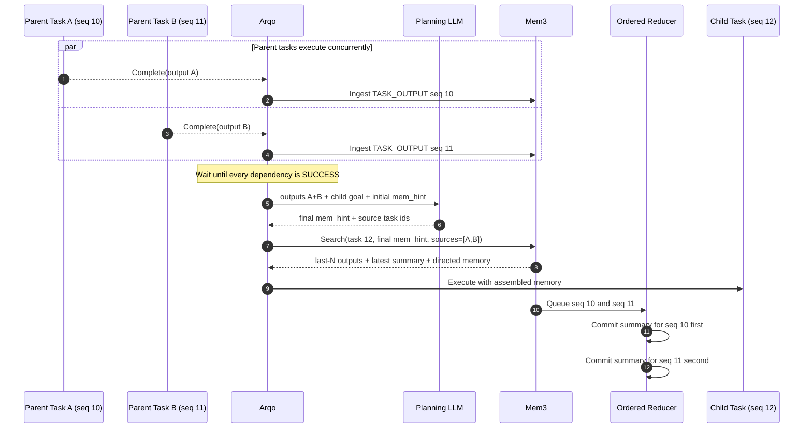

# Mem3 Memory System Detailed Design

Mem3 is Aurora's unified memory data plane. It owns DAG initialization memory, Task sliding-window memory, rolling summaries, and cross-session GraphRAG. API contracts are defined in `doc/spec/Mem3-API-Spec.md`; retrieval hints are defined in `doc/spec/Mem-Hint-Schema.md`.

## 1. Core Principles

1. Scheduling state is stored in Arqo's relational database; memory data is stored in Mem3 KV and Graph stores.
2. Every DAG build must extract an intent slot and call one DAG-level Ingest.
3. Every Task must call Search before execution. Search always assembles the last-N Task outputs and the latest rolling summary, then performs directed retrieval according to `mem_hint`.
4. Every successfully completed Task, including Skill Nodes and Planner Nodes, must call Task-level Ingest.
5. Ingest durably persists the source event and quickly returns accepted; LLM extraction, rolling-summary reduce, and graph writes run asynchronously inside Mem3.
6. `tenant_id` is the mandatory isolation boundary. `agent_id` is the long-term memory namespace. `session_id` and `dag_id` isolate execution-time memory.

## 2. Storage Model

### 2.1 DAG-Level Long-Term Memory

During DAG construction, Intent Router extracts a structured intent slot from the user query and calls:

```text
POST /v1/memory/ingest
kind = DAG_CONTEXT
```

Mem3 first writes the raw query and intent slot into a reliable event store, then asynchronously extracts:

- Goal: what the user wants the current Agent to achieve.
- Profile: relatively stable user, Agent, or Tenant attributes.
- Facts: independently verifiable facts.
- Relations: entity relations for GraphRAG.

The visibility of each candidate memory is controlled by `memory_scope`:

- `DAG`: visible only to the current DAG.
- `SESSION`: visible to the current Session.
- `AGENT`: visible to the specified Agent under the same Tenant.
- `TENANT`: visible to all Agents under the same Tenant.

Information must not be promoted to `AGENT` or `TENANT` long-term memory unless it passes confidence and policy checks. Graph nodes and edges must carry `tenant_id`, `agent_id`, `observed_at`, and source metadata.

### 2.2 Task Episodic Memory

After each Task completes, Mem3 stores one immutable Task Memory record:

```json
{
  "tenant_id": "tenant_1",
  "agent_id": "agent_1",
  "session_id": "session_1",
  "dag_id": "dag_1",
  "task_id": "task_3",
  "node_type": "skill",
  "output": {},
  "rolling_summary": "Cumulative summary through task_3",
  "hard_facts": [],
  "relations": [],
  "completed_at": "2026-06-23T10:00:00Z"
}
```

Recommended KV key:

```text
tenant:{tenant_id}:agent:{agent_id}:session:{session_id}:dag:{dag_id}:task:{sequence}:{task_id}
```

`sequence` must be monotonically assigned by Arqo within the same DAG. It must not depend on asynchronous completion order, otherwise parallel Tasks can make last-N memory non-deterministic.

## 3. Lifecycle

### 3.0 End-to-End Memory Sequence

The following diagram shows the standard flow from DAG creation to Task completion. Dashed arrows represent asynchronous processing and do not block Arqo's main scheduling path.

```mermaid
sequenceDiagram
    autonumber
    actor User
    participant Arqo
    participant Intent as Intent Router
    participant Planner as DAG Planner
    participant Mem3
    participant Async as Mem3 Async Pipeline
    participant KV
    participant Graph
    participant Worker as Skill/Planner Executor

    User->>Arqo: Submit query
    Arqo->>Intent: Extract intent slot
    Intent-->>Arqo: macro_intent, entities, temporal_context, action_verbs

    Arqo->>Mem3: Ingest(DAG_CONTEXT, query, intent_slot)
    Mem3->>KV: Persist source event
    Mem3-->>Arqo: 202 Accepted
    Mem3--)Async: Extract goals, profile, facts, relations
    Async--)KV: Store scoped memories
    Async--)Graph: Upsert scoped relations

    Arqo->>Planner: Build and validate DAG
    Planner-->>Arqo: Nodes with initial mem_hint

    loop Every ready Task
        Arqo->>Mem3: Search(scope, task, recent_limit, final mem_hint)
        Mem3->>KV: List last-N outputs + latest committed summary
        opt Directed retrieval requested
            Mem3->>KV: KV retrieval
            Mem3->>Graph: Graph retrieval
        end
        Mem3-->>Arqo: Working memory + directed retrieval

        Arqo->>Worker: Execute Task with assembled memory
        Worker-->>Arqo: Task output
        Arqo->>Mem3: Ingest(TASK_OUTPUT, sequence, output)
        Mem3->>KV: Persist immutable Task output
        Mem3-->>Arqo: 202 Accepted
        Mem3--)Async: Queue ordered summary reduce
        Async->>KV: Read previous committed summary
        Async--)Async: new_summary = LLM(output, previous_summary)
        Async->>KV: Commit summary_version
        Async--)Graph: Extract and store facts/relations
    end
```



### 3.1 DAG Construction

```text
User Query
  -> Intent Router structured extraction
  -> Mem3 Ingest(DAG_CONTEXT)
  -> Arqo builds the DAG with the same intent slot
```

Intent Router does not wait for asynchronous GraphRAG construction. Once Mem3 has durably accepted the event, DAG generation can continue. If Ingest is unavailable, Arqo must retry according to policy or mark the DAG as `memory-degraded`; it must not silently drop the event.

### 3.2 Before Task Start

Before each Task transitions from `READY` to `RUNNING`, Arqo calls:

```text
POST /v1/memory/search
```

The request must include:

- Current Task identity and trusted scope.
- The final `mem_hint`, generated or refreshed by the planning LLM after parent Tasks complete.
- `recent_limit=N`.

The initial DAG stores the initial `mem_hint` for each node. After parent Tasks complete, Arqo calls the planning LLM with parent Task outputs, the child Task goal, and the initial hint to generate the final `mem_hint`, then writes it back to the child Task. Only then can the child Task enter memory assembly. Root Tasks have no parents; their final `mem_hint` is generated by the initial DAG Planner.

For a Task with multiple parents, Arqo must wait for every parent to complete, generate the final `mem_hint` once from all parent outputs, and record the sources in `mem_hint_source_task_ids` in the Search request. The system must not use last-writer-wins semantics based on whichever parent finishes last.

Search always returns two categories of memory:

1. Working memory:
   - The latest N completed Task outputs ordered by DAG execution sequence.
   - The latest committed rolling summary.
2. Directed memory:
   - KV exact records, Agent/Tenant long-term memory, or GraphRAG results selected by `mem_hint`.

Even when `mem_hint.strategy=NONE`, working memory must still be returned. `NONE` only disables additional directed retrieval.

### 3.3 After Task Completion

After each Skill Node or Planner Node succeeds, Arqo calls:

```text
POST /v1/memory/ingest
kind = TASK_OUTPUT
```

Mem3 processing order:

1. Durably store Task output and Task metadata.
2. Return `202 Accepted` so lightweight LLM latency does not block the scheduler.
3. Serialize summary reduce by DAG submission sequence:

```text
new_summary = lightweight_llm.reduce(
  output = current_task.output,
  last_summary = previous_committed_summary
)
```

4. Atomically store `new_summary` and advance the summary version.
5. Asynchronously extract hard facts and relations, then write them to KV/Graph.

A local `summary` returned by a Skill can only be used as an auxiliary reduce input; it must not replace the rolling summary generated by Mem3. Planner Node planning results are also Task outputs and must be written to Mem3.

Parallel Tasks may complete out of order, so summary reduce must commit in the `sequence` order assigned by Arqo. If an earlier sequence is missing, Mem3 may wait, retry, or place the item into a compensation queue. It must not let asynchronous completion order overwrite the summary.

### 3.4 Multi-Parent Task and Parallel Reduce Sequence

This diagram highlights two independent ordering constraints:

- A child Task's final `mem_hint` must be generated once after all parent Tasks complete.
- Task outputs may arrive at Mem3 out of order, but rolling summaries must commit in `sequence` order.



## 4. API Semantics

### 4.1 Ingest

One unified endpoint accepts two event kinds:

- `DAG_CONTEXT`: raw query and intent slot.
- `TASK_OUTPUT`: successful Task output.

The response only confirms durable acceptance. It does not promise that asynchronous extraction has completed.

### 4.2 List

List is the deterministic KV operation used by Search to assemble working memory:

- Fetch the last N successful Tasks by `sequence DESC`.
- Return outputs without folding last-N outputs into another summary.
- Return the latest committed rolling summary separately.
- Never cross the Tenant, Agent, Session, or DAG boundaries specified by the request.

### 4.3 Search

Search is the only memory-read entry before Task execution. Internally it calls List for working memory, then interprets `mem_hint`:

```text
strategy = NONE        -> working memory only
strategy = EXACT       -> KV exact lookup + working memory
strategy = LOCAL_GRAPH -> 1~2 hop graph retrieval + working memory
strategy = GLOBAL      -> community/macro summary retrieval + working memory
strategy = HYBRID      -> combine KV and graph retrieval + working memory
```

If graph writes lag behind, Mem3 may follow `mem_hint.fallback` and fall back to scoped KV retrieval, but it must never cross Tenant boundaries.

## 5. Consistency and Failure Handling

- Ingest requests must carry `idempotency_key`; retries must not create duplicate Task Memories or duplicate graph edges.
- Search can only see summaries whose `summary_version` has been committed.
- If Task Ingest is accepted but reduce fails, the raw output remains available through List/Search and the background pipeline retries reduce.
- Arqo does not need to wait for reduce before waking downstream Tasks. If a downstream edge must read the current Task's new summary, the edge can set `memory_barrier=true` and wait for the corresponding `summary_version` to commit.
- All long-term memory promotion and graph writes keep source, confidence, and timestamp metadata to support audit, revocation, and forgetting.
